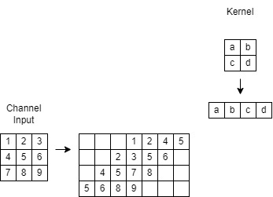
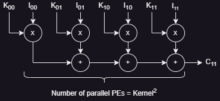
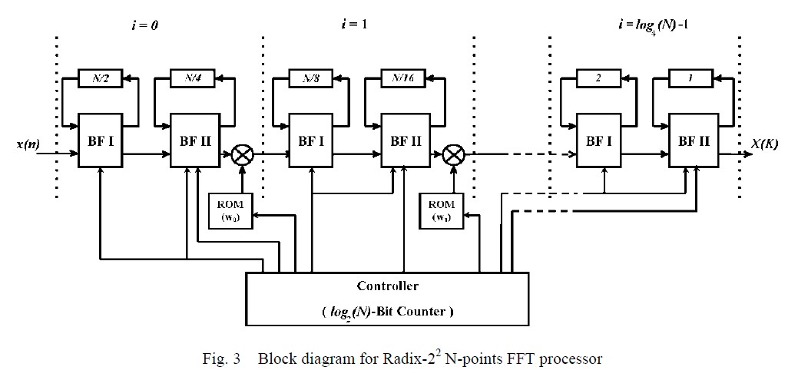
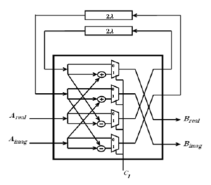
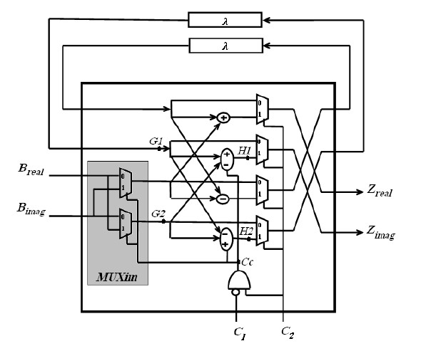
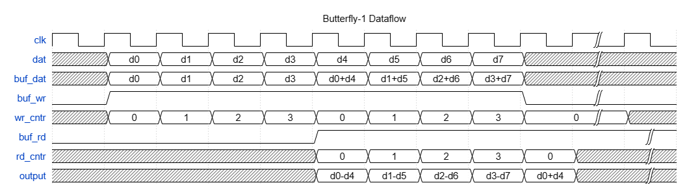

# cnn_verilog

This repository is created to develop a convolution mechanism to be deployed on an FPGA.

Currently, this code doesn't consider padding and striding. The implementation is just a basic implementation where it takes an image and a kernel as inputs. It then finds the windows from the image of the same size as kernels and then performs a convolution on it, which is just a multiplication and an addition of all the multiplied results.

The current TODO list includes:
- [x] Implement Python code to generate input stimulus
- [ ] Add support for padding and stride
- [ ] Develop a testbench to compare the outputs
- [ ] Create and test a Neural Network Model based on it

The direction of this repo has pivoted. ***This repo will now focus on development of an FFT-OVA based CNN hardware accelerator.*** [[1]](#1) [[2]](#2) [[3]](#3)

## Dataflow for Standard Convolution

This section explains the data flow of the computations in convolution.

The data is extracted from channel and kernel matrices in the Toeplitz Matrix format.



MAC operation is then performed on the two matrices shown in the figure below.



## Dataflow for FFT-OVA based Convolution

This section explains the architecture of the Radix-2^2 FFT design.[[2]](#2).



The architecture has log4(N) stages with each stages having two butterfly structures.

The first butterfly structure is explained below.



The figure shows the Butterfly-II structure to perform multiplications with '-j'



The waveform below shows the dataflow in a butterfly-1 structure for an 8-point FFT.



## Running Simulation

The testbench files are in the *tests* folder. The scripts to run modelsim simulations are in the *modelsim* folder.

Commands to run RTL Simulations:
```
cd modelsim
bash runsim.sh -sim_type rtl
```

To specify the test to run, add the test bench module name. Example below:
```
bash runsim.sh -sim_type rtl -top tb_radix22_top
```

## Running Synthesis

The design has been synthesized using ASU's 7nm PDK. Commands to run synthesis using Synopsys Design Compiler:
```
cd synth
dc_shell -f synth.tcl -output_log_file syn.log
```

## Running Gate-Level Simulations

Commands to run Gate-Level simulations:
```
cd modelsim
bash runsim.sh -sim_type gls
```

The argument to specify the test is the same.

## References

<a id="1">[1]</a>
T. Highlander and A. Rodriguez, “Very efficient training of convolutional neural networks using fast fourier transform and overlap-and-add,” CoRR, Jan. 2016. [Online]. Available: http://arxiv.org/abs/1601.06815

<a id="2">[2]</a>
Saeed, Ahmed, et al. "Efficient FPGA implementation of FFT/IFFT processor." International Journal of circuits, systems and signal processing 3.3 (2009): 103-110.

<a id="3">[3]</a>
Liang, Yun, et al. "Evaluating fast algorithms for convolutional neural networks on FPGAs." IEEE Transactions on Computer-Aided Design of Integrated Circuits and Systems 39.4 (2019): 857-870.

